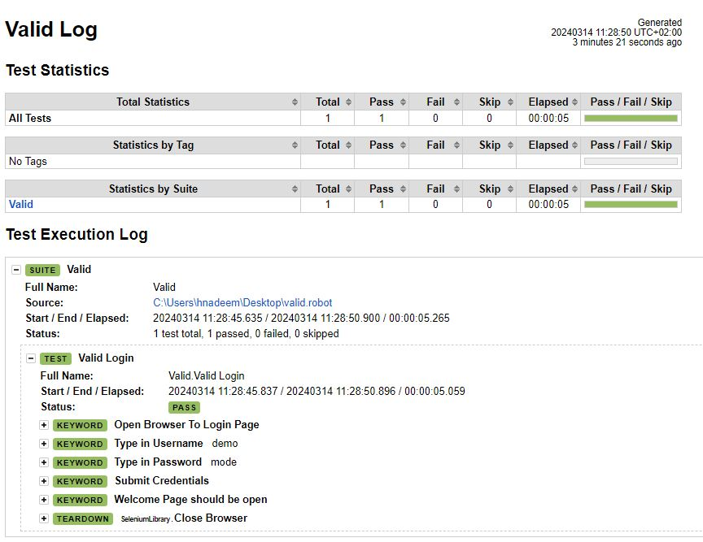

====================================================
Web testing with Robot Framework and SeleniumLibrary
====================================================
What is Robot Framework?
========================
`Robot Framework` (RF) is an open-source test automation framework for acceptance testing and
robotic process automation. It uses a keyword-driven approach and supports behavior driven
development (BDD). With its simple syntax and extensibility, it enables efficient creation
and execution of automated tests across various platforms and applications. It also offers
integration with other tools and libraries for enhanced functionality and flexibility.

Test case
==========
In the test, I validate logging into a webpage with a username and password using Selenium Library in RF.
This test has a workflow that is created using keywords in the imported resource file.

`valid.robot`_
    A resource file with reusable keywords and variables.

    The system specific keywords created here form our own
    domain specific language. They utilize keywords provided
    by the imported SeleniumLibrary_.

Generated results
=================

After `running tests`_ you will get report and log in HTML format. Example
files are also visible online in case you are not interested in running
the demo yourself:

- `report.html`_
- `log.html`_

Starting demo application
-------------------------

Running tests requires the `demo application`_ located under ``demoapp``
directory to be running.  It can be started either by double clicking
``demoapp/server.py`` file in a file manager or by executing it from the
command line::

    python demoapp/server.py

After the demo application is started, it is be available in URL
http://localhost:7272. You can test it manually, valid credentials are
``demo/mode``, and it needs to be running while executing the automated
tests.

If the application was started by double-clicking ``demoapp/server.py``
file, it can be shut down by closing the opened window. If it was
executed from the command line, using ``Ctrl-C`` is enough.
